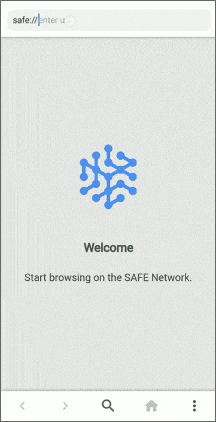
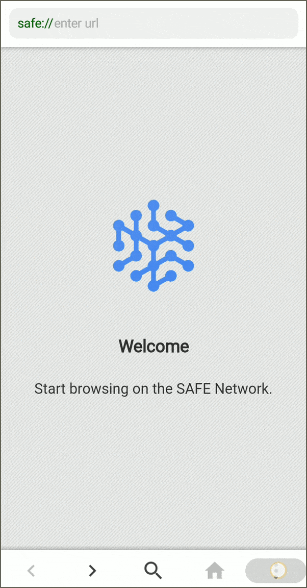
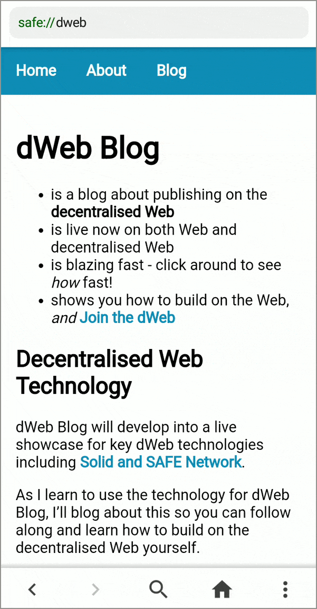

# SAFE Mobile Browser

The SAFE Mobile Browser is a mobile web browser for the SAFE Network.

**Maintainer:** Ravinder Jangra (ravinder.jangra@maidsafe.net)

## Build Status

|CI service|Platform|Status|
|---|---|---|
|Azure DevOps|MacOS|  |

## Table of Contents

1. [Overview](#Overview)
2. [Supported platforms](#Documentation)
3. [Features](#Features)
4. [User Guide](#User-Guide)
5. [Development](#Development)
    * [Project Structure](#Project-structure)
    * [Tools required](#Tools-required)
6. [Contributing](#Contributing)
7. [Copyrights](#Copyrights)
8. [Further Help](#Further-Help)
9. [License](#License)

## Overview

The SAFE Mobile Browser is a cross-platform mobile (Android, iOS) browser, built to provide web browsing experience to the users on the SAFE Network.

The app currently uses the [MaidSafe.SafeApp](https://www.nuget.org/packages/MaidSafe.SafeApp/) NuGet package to fetch the content from the network.

## Supported platforms

* Android 5.1+ (armeabi-v7a, x86_64)
* iOS 11+ (ARM64, x64)

## Features

* Fetch static websites from the SAFE Network.
* Bookmarks (sync with SAFE Desktop Browser).

## User Guide

### Installation

The latest version of the SAFE Mobile browser for the Android mobile phones can be download from the [Release](/releases/latest) tab. For iOS users can build the latest version from the master branch. Check [development section](#Development) for build instruction.

### Browsing SAFE websites

Once installed, mobile browser can be used to browse the websites hosted on Alpha-2 network.

***Note:** Make sure to whitelist/update your IP address on [invite server](https://invite.maidsafe.net) before you start browsering.*

| Browser launch page |Fetching website from the SAFE Network |
|:---:|:---:|
||  |

### Working with bookmarks

To use bookmarks feature in mobile browser, we need to authenticate the app using [SAFE mobile Authenticator app](https://github.com/maidsafe/safe-authenticator-mobile).

| Authenticate | Add bookmark | Remove bookmark | Manage bookmarks |
|:---:|:---:|:--:|:--:|
||  |  |  |

## Development

### Project structure

* **SafeMobileBrowser:**
  * Common UI code and SAFE logic for mobile browser
* **SafeMobileBrowser.Platform:**
  * Platform: Android, iOS
  * Platform specific/dependent code
    * Custom controls for native UI
    * Platform assets
    * Platform dependent service code

### Tools required

* [Visual Studio](https://visualstudio.microsoft.com/) 2017 or later editions with the following workloads:
  * [Mobile development with .NET (Xamarin)](https://visualstudio.microsoft.com/vs/visual-studio-workloads/)

## Contributing

As an open source project, we're excited to accept contributions to the code from outside of MaidSafe and are striving to make that as easy and clean as possible.

With enforced linting and commit style clearly laid out, as well as a list of more accessible issues for any project labelled with Help Wanted.

### Project board

GitHub project boards are used by the maintainers of this repository to keep track and organise development priorities.

There could be one or more active project boards for a repository. One main project will be used to manage all tasks corresponding to the main development stream (master branch). A separate project may be used to manage each PoC and/or prototyping development, and each of them will track a dedicated development branch.

New features which imply a big number of changes will be developed in a separate branch but tracked in the same main project board, re-basing it with master branch regularly and fully testing the feature on its branch before it's merged into the master branch after it was fully approved.

The main project contains the following Kanban columns to track the status of each development task:

* `Triage`: New issues which need to be reviewed and evaluated before taking the decision to implement it.
* `Low Priority`: Issues that will be picked up in the current milestone.
* `In Progress`: Task is assigned to a person and it's in progress.
* `Needs Review`: A Pull Request which completes the task has been sent and it needs to be reviewed.
* `Reviewer approved`: The PR sent was approved by reviewer/s and it's ready for merge.
* `Ready for QA`: The fix for the issue has been merged into master and is ready for final QA testing.
* `Done`: QA has verified that the fix is complete and does not affect anything else.

### Issues

Issues should clearly lay out the problem, platforms experienced on, as well as steps to reproduce the issue.

This aids in fixing the issues but also quality assurance, to check that the issue has indeed been fixed.

Issues are labelled in the following way depending on its type:

* `bug`: The issue is a bug in the product.
* `feature`: The issue is a new and inexistent feature to be implemented.
* `enhancement`: The issue is an enhancement to either an existing feature in the product or to the infrastructure around the development process.
* `blocked`: The issue cannot be resolved as it is blocked by another task. In this case, the task that it is blocked by should be referenced.
* `documentation`: A documentation-related task.
* `e/__`: Specifies the effort required for the task.
* `p/__`: Specifies the priority of the task.

### Commits and Pull Requests

Commit message should follow [these guidelines](https://github.com/autumnai/leaf/blob/master/CONTRIBUTING.md#git-commit-guidelines) and should therefore strive to tackle one issue/feature, and code should be pre-linted before commit.

PRs should clearly link to an issue to be tracked on the project board. A PR that implements/fixes an issue is linked using one of the [GitHub keywords](https://help.github.com/articles/closing-issues-using-keywords). Although these type of PRs will not be added themselves to a project board (just to avoid redundancy with the linked issue). However, PRs which were sent spontaneously and not linked to any existing issue will be added to the project and should go through the same process as any other tasks/issues.

Where appropriate, commits should _always_ contain tests for the code in question.

### Changelog and releases

The changelog is currently maintained manually, each PR sent is expected to have the corresponding modification in the CHANGELOG file, under the 'Not released' section.

The release process is triggered by the maintainers of the package once it is merged to master.

## Copyrights

Copyrights in the SAFE Network are retained by their contributors. No copyright assignment is required to contribute to this project.

## Further help

Get your developer related questions clarified on [SAFE Dev Forum](https://forum.safedev.org/). If you're looking to share any ideas or thoughts on the SAFE Network you can reach out on [SAFE Network Forum](https://safenetforum.org/)

## License

Licensed under the General Public License (GPL), version 3 [LICENSE](http://www.gnu.org/licenses/gpl-3.0.en.html).
